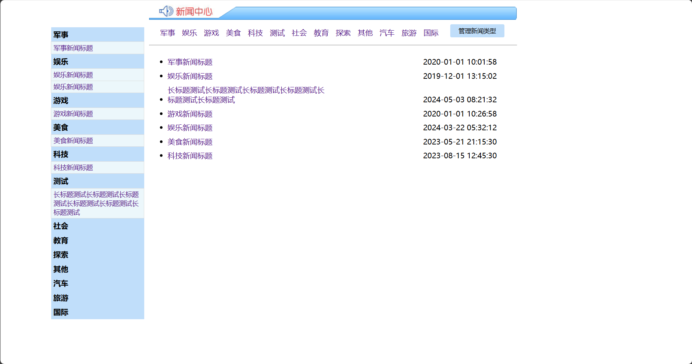
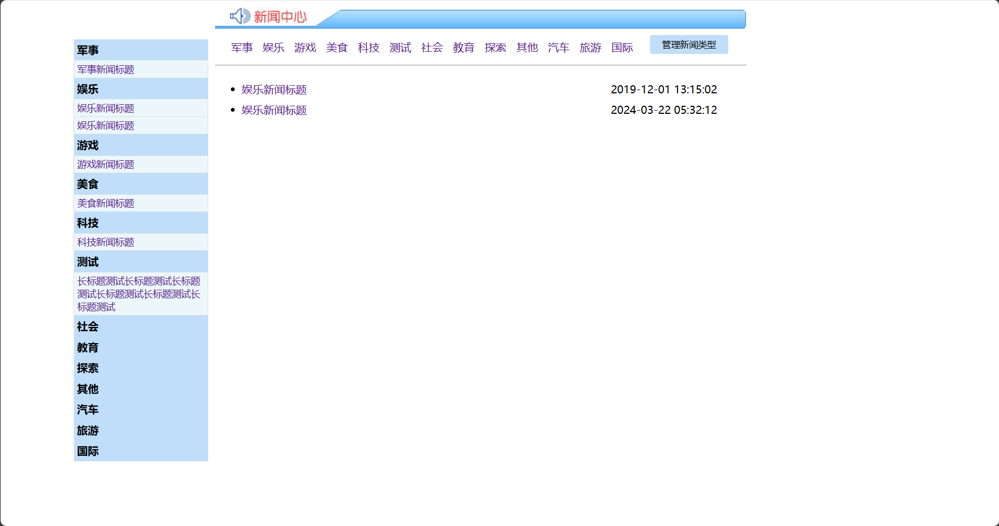
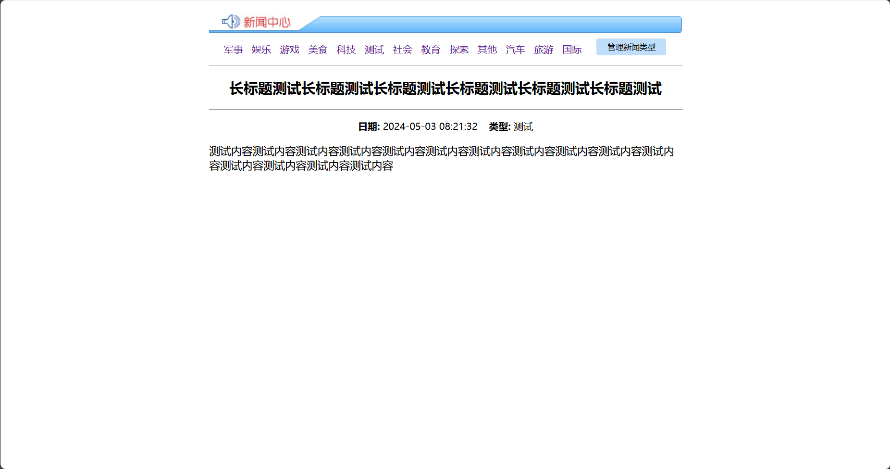
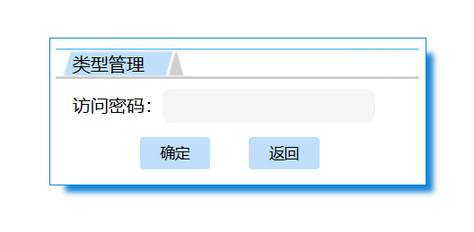
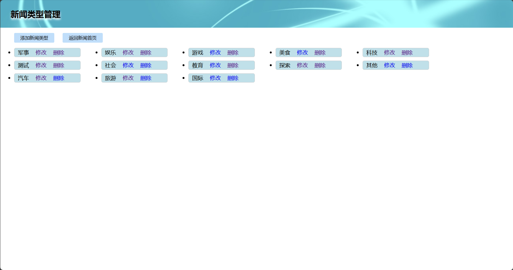
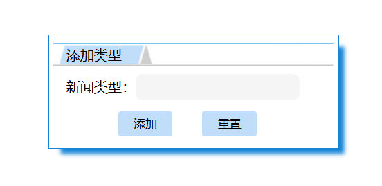
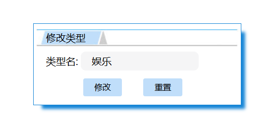

# JavaWeb笔记(IDEA+Tomcat) - Bairu

- [JavaWeb笔记(IDEA+Tomcat) - Bairu](#javaweb笔记ideatomcat---bairu)
  - [一、IDEA创建JavaWeb项目](#一idea创建javaweb项目)
  - [二、IDEA中遇到的问题及解决办法](#二idea中遇到的问题及解决办法)
    - [1. IDEA不识别JSP内置对象（request等）](#1-idea不识别jsp内置对象request等)
    - [2. Tomcat控制台输出乱码](#2-tomcat控制台输出乱码)
    - [3. 将.jsp文件放在web目录的下级目录中(如`\web\JSP\index.jsp`), 运行后报404](#3-将jsp文件放在web目录的下级目录中如webjspindexjsp-运行后报404)
    - [4. 使用自定义文件名的jsp文件时, 运行报404](#4-使用自定义文件名的jsp文件时-运行报404)
    - [5. 将jstl相关jar包复制到`\web\WEB-INF\lib`目录下后, jsp页面中不识别jstl标签](#5-将jstl相关jar包复制到webweb-inflib目录下后-jsp页面中不识别jstl标签)
    - [6. 新版IDEA新建文件没有Servlet模板](#6-新版idea新建文件没有servlet模板)
    - [7. 新版IDEA新建文件没有Filter模板](#7-新版idea新建文件没有filter模板)
    - [8. 实现在一个JSP页面打开时就加载Servlet (从Servlet调用jsp)](#8-实现在一个jsp页面打开时就加载servlet-从servlet调用jsp)
  - [三、实训成果 - 简易新闻发布系统](#三实训成果---简易新闻发布系统)

## 一、IDEA创建JavaWeb项目

0. 环境版本

    - IDEA: IntelliJ IDEA 2024.2.1 (Ultimate Edition)

    - Tomcat: Apache Tomcat 9.0.94

1. 新建项目

   - 填写项目名和项目路径.

   - 构建系统选择`IntelliJ`.

   - JDK选择`1.8`.

2. 添加Web框架支持

    - 打开`文件`-`项目结构`-`项目设置`-`模块`, 点击右侧`+`, 选择`Web`.
    
    - 点击右下角`创建工件`.
    
    - 点击`确定`.

3. 配置Tomcat

    - 打开`运行`-`编辑配置`, 点击左上角`+`, 选择`Tomcat 服务器 - 本地`.
    
    - `服务器`选项卡中, `应用程序服务器`项设为安装的Tomcat, `JRE`选择`1.8`, 点击`应用`.
    
    - `部署`选项卡中, 点击`+`, 选择`工件...`(`应用程序上下文`可以自定义, 注意不能有空格), 点击`应用`.
    
    - 点击`确定`.

4. 设置资源自动更新

    - 打开`运行`-`编辑配置`, 把`服务器`选项卡中的`执行"更新"操作`和`切换出IDE时`项设置为`更新类和资源`, 点击`确定`.

5. 导入Tomcat库

    - 打开`文件`-`项目结构`-`项目设置`-`库`, 点击`+`, 选择`Java`, 找到`\Tomcat根目录\lib`目录添加到模块中.

6. 配置路径

    - 在`web\WEB-INF`目录下创建`lib`文件夹, 用于保存引入的包.

    - 注意: 将jar包复制到`\web\WEB-INF\lib`目录下后, 还要打开`文件`-`项目结构`-`项目设置`-`库`, 点击`+`, 将复制的jar包添加到模块中.

## 二、IDEA中遇到的问题及解决办法

### 1. IDEA不识别JSP内置对象（request等）  

- 到`文件`-`项目结构`-`项目设置`-`库`, 点击`+`, 选择`Java`, 找到`\Tomcat根目录\lib`目录添加到模块中.

### 2. Tomcat控制台输出乱码

- 打开`\Tomcat根目录\conf\logging.properties`文件, 将文件中所有`xxx.encoding`的值改为GBK, 然后到IDEA中点击`帮助`-`编辑自定义虚拟机选项...`, 在弹出的文件中添加`-Dfile.encoding=GBK`指令, 保存后重启IDEA.

### 3. 将.jsp文件放在web目录的下级目录中(如`\web\JSP\index.jsp`), 运行后报404

- 打开`项目结构`-**`模块`**, 进入`Web`页面, 把`Web资源目录`中的路径改到`项目路径\web\JSP所在目录`.

- **注意:** 必须在 **`模块`** 中修改, 在`Facet`中修改无效, 并注意删除`部署描述符`一栏中多余的路径.

### 4. 使用自定义文件名的jsp文件时, 运行报404

- 当文件名不是`index.jsp`时, 需要在地址栏手动添加`/文件名.jsp`才能访问.

- 或者要把自定义文件名的jsp文件设为默认启动页, 可在`\web\WEB-INF\web.xml`文件的`<web-app>`标签内添加以下内容:

    ```xml
    <welcome-file-list>
        <welcome-file>jsp文件名.jsp</welcome-file>
    </welcome-file-list>
    ```

### 5. 将jstl相关jar包复制到`\web\WEB-INF\lib`目录下后, jsp页面中不识别jstl标签

- 打开`项目结构`-`库`, 点击`+`, 选择`Java`, 找到项目路径中的`jstl.jar`和`standard.jar`添加到模块中.

### 6. 新版IDEA新建文件没有Servlet模板

- 到`文件`-`设置`-`编辑器`-`文件和代码模板`-`文件`, 点击`+`, 在右侧填写名称为`Servlet Class - 注解`, 将以下内容粘贴到右侧代码输入框后点击`确定`.

    ```java
    #if (${PACKAGE_NAME} && ${PACKAGE_NAME} != "")package ${PACKAGE_NAME};#end
    #parse("File Header.java")

    #if ($JAVAEE_TYPE == "jakarta")
    import jakarta.servlet.*;
    import jakarta.servlet.http.*;
    import jakarta.servlet.annotation.*;
    #else
    import javax.servlet.*;
    import javax.servlet.http.*;
    import javax.servlet.annotation.*;
    #end
    import java.io.IOException;

    @WebServlet("/${Entity_Name}")
    public class ${Class_Name} extends HttpServlet {
        private static final long serialVersionUID = 1L;

        @Override
        protected void doGet(HttpServletRequest request, HttpServletResponse response) throws ServletException, IOException {
            
        }

        @Override
        protected void doPost(HttpServletRequest request, HttpServletResponse response) throws ServletException, IOException {
            
            doGet(request, response);
        }
    }
    ```

- 添加上述Servlet模板后, 在`文件`-`新建`中即可看到`Servlet Class - 注解`项. 

- 新建Servlet类时IDEA会提示输入`JAVAEE TYPR`, `Entity Name`和`Class Name`, 其含义分别为:

  - `JAVAEE TYPE`: Java API版本, 可选项为`jakarta`(新版) 或 `javax`(旧版). 此项可不填, 默认为`javax`.

  - `Entity Name`: 填写在`@WebServlet`注解中的内容, 即需要Servlet处理的请求的路径.

  - `Class Name`: 类名

### 7. 新版IDEA新建文件没有Filter模板

- 到`文件`-`设置`-`编辑器`-`文件和代码模板`-`文件`, 点击`+`, 在右侧填写名称为`Filter Class - 注解`, 将以下内容粘贴到右侧代码输入框后点击`确定`.

    ```java
    #if (${PACKAGE_NAME} && ${PACKAGE_NAME} != "")package ${PACKAGE_NAME};#end
    #parse("File Header.java")

    #if ($JAVAEE_TYPE == "jakarta")
    import jakarta.servlet.*;
    import jakarta.servlet.annotation.*;
    #else
    import javax.servlet.*;
    import javax.servlet.annotation.*;
    #end
    import java.io.IOException;

    @WebFilter("/${Entity_Name}")
    public class ${Class_Name} implements Filter {
        public void init(FilterConfig config) throws ServletException {
        }

        public void destroy() {
        }

        @Override
        public void doFilter(ServletRequest request, ServletResponse response, FilterChain chain) throws ServletException, IOException {
            
            chain.doFilter(request, response);
        }
    }
    ```

- 添加上述Filter模板后, 在`文件`-`新建`中即可看到`Filter Class - 注解`项. 

- 新建Filter类时IDEA会提示输入`JAVAEE TYPR`, `Entity Name`和`Class Name`, 其含义分别为:

  - `JAVAEE TYPE`: Java API版本, 可选项为`jakarta`(新版) 或 `javax`(旧版). 此项可不填, 默认为`javax`.

  - `Entity Name`: 填写在`@WebFilter`注解中的内容, 即过滤器将处理的请求范围.

  - `Class Name`: 类名

### 8. 实现在一个JSP页面打开时就加载Servlet (从Servlet调用jsp)

- 把Servlet类`@WebServlet`注解中的实体名称添加到`web.xml`的`<welcome-file-list>`中.

- 例如: Servlet类中`@WebServlet`注解为`@WebServlet("/NewsTypeController")`, 则`web.xml`中添加:

    ```xml
    <welcome-file-list>
        <welcome-file>NewsTypeController</welcome-file>
    </welcome-file-list>
    ```

## 三、实训成果 - 简易新闻发布系统

- 新闻展示首页  

    

- 按类型展示新闻  

    

- 新闻详情页  

    

- 新闻管理页访问密码

    

- 新闻类型管理页  

    

- 添加新闻类型  

    

- 修改新闻类型  

    
